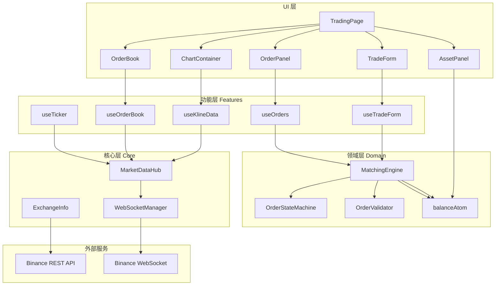
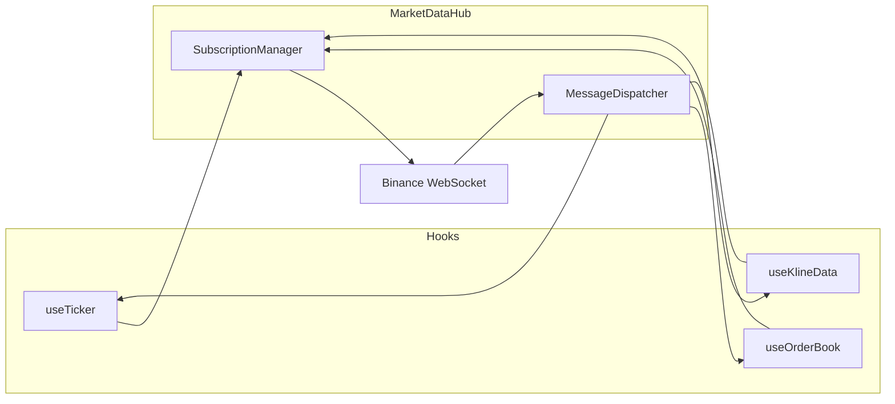
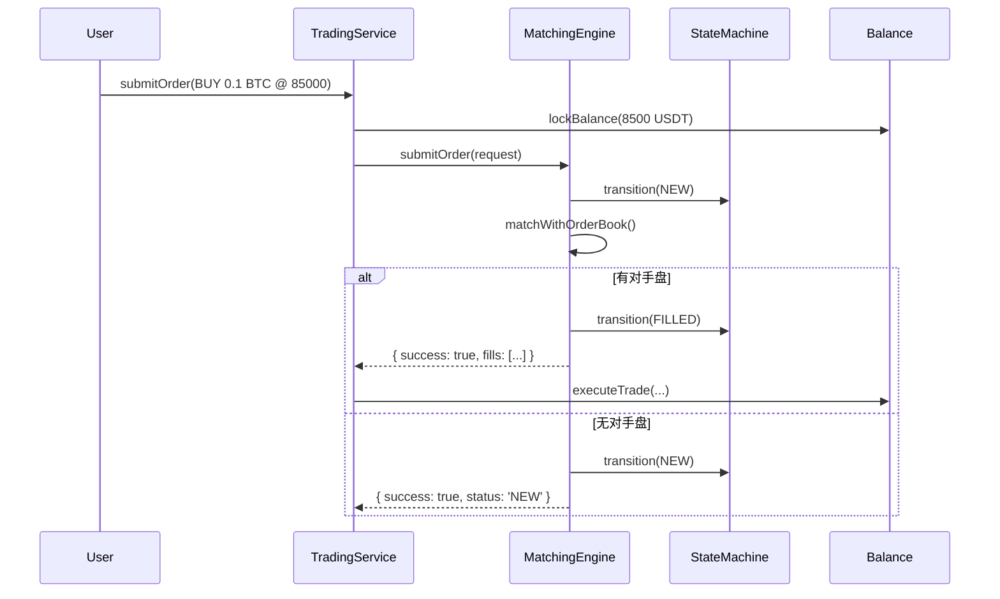
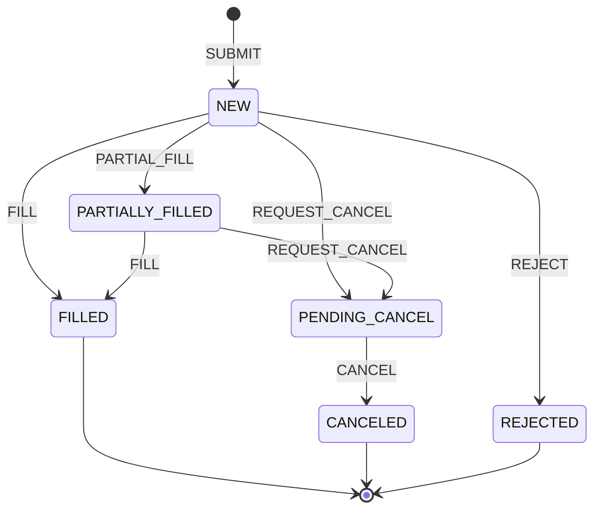
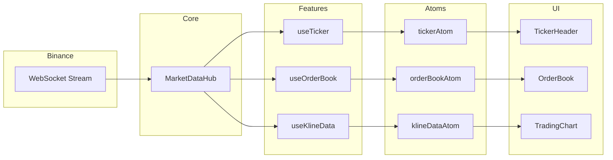
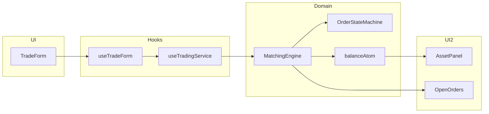

# CEX 现货交易页 - 技术架构与实现指南

> 一个高仿真的 CEX（中心化交易所）现货交易页面原型，使用 React + TypeScript + Jotai 构建，集成 Binance 实时行情数据。

---

## 目录

1. [项目概述](#1-项目概述)
2. [整体架构](#2-整体架构)
3. [核心层 - Core](#3-核心层---core)
4. [领域层 - Domain](#4-领域层---domain)
5. [功能层 - Features](#5-功能层---features)
6. [组件层 - Components](#6-组件层---components)
7. [数据流](#7-数据流)
8. [关键设计决策](#8-关键设计决策)

---

## 1. 项目概述

### 1.1 项目目标

构建一个高保真的 CEX 现货交易页面原型，实现：
- ✅ 实时 K 线图表（基于 Lightweight Charts）
- ✅ 实时 OrderBook 深度数据
- ✅ 模拟下单与撮合
- ✅ 账户余额管理
- ✅ 订单状态追踪

### 1.2 技术栈

| 类别 | 技术 |
|------|------|
| 框架 | React 18 + TypeScript |
| 状态管理 | Jotai (原子化状态) |
| 图表 | Lightweight Charts |
| 样式 | Tailwind CSS |
| 数据源 | Binance REST API + WebSocket |
| 精度计算 | Decimal.js |
| 虚拟列表 | react-window |

---

## 2. 整体架构

### 2.1 分层架构图



### 2.2 目录结构

```
src/
├── core/                    # 核心基础设施
│   ├── gateway/             # WebSocket 网关
│   │   ├── MarketDataHub.ts
│   │   ├── SubscriptionManager.ts
│   │   └── types.ts
│   └── config/              # 交易规则配置
│       ├── ExchangeInfo.ts
│       └── useExchangeInfo.ts
│
├── domain/                  # 领域逻辑（业务核心）
│   ├── trading/             # 交易领域
│   │   ├── engine/          # 撮合引擎
│   │   │   ├── MatchingEngine.ts
│   │   │   ├── OrderStateMachine.ts
│   │   │   └── OrderValidator.ts
│   │   ├── hooks/
│   │   │   └── useTradingService.ts
│   │   └── types/
│   │       └── order.ts
│   └── account/             # 账户领域
│       └── balanceAtom.ts
│
├── features/                # 功能模块
│   ├── chart/               # K 线图表
│   ├── orderbook/           # 订单簿
│   ├── ticker/              # 行情数据
│   ├── trade/               # 交易表单
│   ├── orders/              # 订单管理
│   └── symbol/              # 交易对选择
│
├── components/              # 通用组件
│   └── trading/
│       ├── AssetPanel.tsx
│       └── RecentTrades.tsx
│
├── services/                # 服务层
│   └── api/
│       └── binance.ts
│
├── utils/                   # 工具函数
│   └── decimal.ts
│
└── workers/                 # Web Workers
    └── orderbook.worker.ts
```

---

## 3. 核心层 - Core

核心层提供基础设施能力，不包含业务逻辑。

### 3.1 MarketDataHub - 统一订阅层

**位置**: `src/core/gateway/MarketDataHub.ts`

**职责**: 管理单一 WebSocket 连接，提供动态订阅/取消订阅能力。



**核心 API**:
```typescript
// 订阅数据流
const unsubscribe = marketDataHub.subscribe('ticker', 'BTCUSDT');

// 注册消息处理器
const unregister = marketDataHub.onMessage('ticker', (data) => {
  console.log('Ticker update:', data);
});
```

**关键特性**:
- 单一连接：所有数据流共享一个 WebSocket
- 引用计数：通过 SubscriptionManager 管理订阅，避免重复
- 自动重连：断线后自动重连并恢复订阅

---

### 3.2 ExchangeInfo - 交易规则服务

**位置**: `src/core/config/ExchangeInfo.ts`

**职责**: 获取并缓存交易规则（价格精度、数量精度、最小交易额等）。

```typescript
interface SymbolConfig {
  symbol: string;           // "BTCUSDT"
  baseAsset: string;        // "BTC"
  quoteAsset: string;       // "USDT"
  pricePrecision: number;   // 2
  quantityPrecision: number;// 6
  minNotional: string;      // "10.00000000"
  tickSize: string;         // "0.01"
  stepSize: string;         // "0.000001"
}
```

**缓存策略**: 使用 localStorage 缓存 24 小时，避免频繁请求。

---

## 4. 领域层 - Domain

领域层包含核心业务逻辑，是整个应用的"大脑"。

### 4.1 MatchingEngine - 撮合引擎

**位置**: `src/domain/trading/engine/MatchingEngine.ts`

**职责**: 模拟 CEX 订单撮合逻辑。



**支持的订单类型**:
- `LIMIT`: 限价单
- `MARKET`: 市价单
- `STOP_LIMIT`: 止损限价单

---

### 4.2 OrderStateMachine - 订单状态机

**位置**: `src/domain/trading/engine/OrderStateMachine.ts`

**职责**: 管理订单生命周期状态转换。



---

### 4.3 balanceAtom - 账户余额管理

**位置**: `src/domain/account/balanceAtom.ts`

**职责**: 使用 Jotai 原子管理模拟账户余额。

**核心 Atoms**:
```typescript
// 账户信息
accountAtom: { balances: Record<string, AssetBalance>, updateTime: number }

// 可用余额（派生）
availableBalancesAtom: Record<string, string>

// 操作 Atoms
lockBalanceAtom      // 下单时冻结
unlockBalanceAtom    // 撤单时解冻
executeTradeAtom     // 成交时结算
resetAccountAtom     // 重置账户
depositAtom          // 充值
```

---

## 5. 功能层 - Features

功能层按业务功能划分模块，每个模块包含组件、hooks 和 atoms。

### 5.1 Chart 模块 - K 线图表

**结构**:
```
features/chart/
├── atoms/
│   ├── klineAtom.ts      # K 线数据状态
│   └── crosshairAtom.ts  # 十字线状态
├── components/
│   ├── ChartContainer.tsx
│   ├── ChartToolbar.tsx
│   └── OHLCVPanel.tsx
└── hooks/
    ├── useKlineData.ts     # 数据获取 + 实时更新
    └── useChartInstance.ts # 图表实例管理
```

**数据流**:
```
Binance API ──(历史数据)──> useKlineData ──> klineAtom ──> useChartInstance ──> Chart
                               ↑
Binance WS ──(实时更新)────────┘
```

**左侧翻页**: 当用户滚动到图表左边界时，自动加载更早的历史数据。

---

### 5.2 OrderBook 模块 - 订单簿

**结构**:
```
features/orderbook/
├── atoms/
│   └── orderBookAtom.ts
├── components/
│   ├── OrderBook.tsx      # 主组件（虚拟列表）
│   └── DepthChart.tsx     # 深度图
└── hooks/
    └── useOrderBook.ts    # 数据订阅
```

**性能优化**:
- 使用 Web Worker 进行深度合并计算
- 使用 react-window 虚拟列表渲染
- 字符串比较避免浮点精度问题

---

### 5.3 Trade 模块 - 交易表单

**结构**:
```
features/trade/
├── atoms/
│   └── tradeAtom.ts       # 表单状态
├── components/
│   └── TradeForm.tsx      # 交易表单 UI
└── hooks/
    └── useTradeForm.ts    # 表单逻辑 + 下单
```

**与交易服务集成**:
```typescript
const { submitOrder, availableBalances } = useTradingService();

// 下单
const response = submitOrder({
  side: 'BUY',
  type: 'LIMIT',
  quantity: '0.1',
  price: '85000',
});

if (response.success) {
  console.log('Order placed:', response.order);
}
```

---

## 6. 组件层 - Components

### 6.1 AssetPanel - 资产面板

**位置**: `src/components/trading/AssetPanel.tsx`

**功能**:
- 显示账户资产余额（可用 + 锁定）
- 显示 USD 估值
- 提供 "重置账户" 和 "快捷充值" 按钮

### 6.2 RecentTrades - 最新成交

**位置**: `src/components/trading/RecentTrades.tsx`

**功能**:
- 实时显示最新成交记录
- 首屏加载历史成交数据
- 使用 react-window 虚拟列表优化

---

## 7. 数据流

### 7.1 实时行情数据流



### 7.2 交易下单数据流



---

## 8. 关键设计决策

### 8.1 为什么用 Jotai 而不是 Redux/Zustand？

| 考量 | Jotai 优势 |
|------|-----------|
| 精细更新 | 原子级订阅，仅触发使用该 atom 的组件更新 |
| 派生状态 | 天然支持 derived atoms，无需 selector |
| 代码量 | 极简 API，无需定义 actions/reducers |
| 异步 | 原生支持异步 atoms |

### 8.2 为什么用单一 WebSocket？

- 减少连接数，降低服务器压力
- 简化连接状态管理
- 统一的重连逻辑

### 8.3 为什么用 Web Worker 处理 OrderBook？

OrderBook 深度合并是 CPU 密集型操作，在主线程执行会阻塞 UI。使用 Web Worker：
- 不阻塞 UI 渲染
- 保持 60fps 流畅交互
- 可并行处理多个深度级别

### 8.4 为什么用 Decimal.js？

JavaScript 浮点数精度问题：
```javascript
0.1 + 0.2 === 0.3  // false (实际是 0.30000000000000004)
```

对于金融场景，精度至关重要。Decimal.js 提供任意精度的十进制运算。

---

## 附录：快速上手

### 启动项目

```bash
cd /Users/wei.he/Documents/GitHub/trading
npm install
npm run dev
```

### 关键文件快速导航

| 功能 | 文件 |
|------|------|
| WebSocket 管理 | `src/core/gateway/MarketDataHub.ts` |
| 撮合引擎 | `src/domain/trading/engine/MatchingEngine.ts` |
| 账户余额 | `src/domain/account/balanceAtom.ts` |
| K 线数据 | `src/features/chart/hooks/useKlineData.ts` |
| 交易表单 | `src/features/trade/hooks/useTradeForm.ts` |
| 订单簿 | `src/features/orderbook/hooks/useOrderBook.ts` |

---

*文档生成时间: 2026-01-29*
