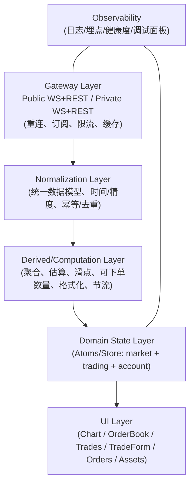
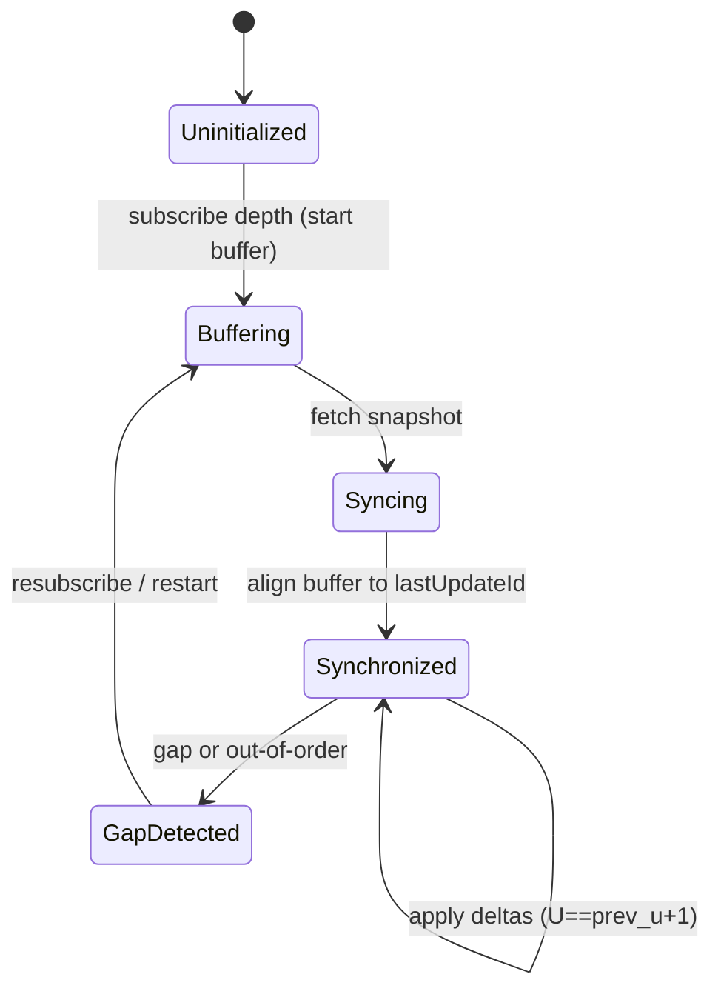

# CEX 现货交易终端（整页）参考架构（Industry Reference Architecture）

> 目标：给出一个"交易所级"现货交易终端的全景架构：页面模块、数据平面、领域模型、关键流程、性能与稳定性策略。
> 
> 适用范围：
> - Spot（现货）交易终端（Web）
> - 可用于真实 CEX（有后端）或纯前端模拟（无后端）
> 
> 非目标：
> - KYC/法币出入金/资金密码/权限风控等完整交易所后台能力
> - 合约/永续（会多出资金费率、标记价格、爆仓、仓位保证金等体系）

---

## 1. 交易终端的"整页"组成：你在页面上看到的是什么？

一个成熟的交易终端通常被分成 6 个高频模块（不同交易所布局不同，但信息架构类似）：

1) 市场导航（Market）
- 交易对切换（理解为"全局上下文"）
- 全量市场列表 + 搜索/筛选/排序（按报价资产、涨跌幅、成交额等）
- 自选（Favorites）+ 最近浏览（Recents）

2) 顶栏行情（Top Ticker）
- 最新价、24h 涨跌、24h 高低、24h 成交量/成交额
- 网络状态、数据延迟（高级终端会有）

3) 图表区（Chart）
- K 线/指标/成交量子图
- 十字线、缩放、拖拽、时间轴
- 叠加层（订单线/止损线/成交标记/均价线等：Chart Trading）

4) 盘口区（Order Book + Depth）
- 订单簿（聚合档位、买卖盘、深度条背景）
- 深度图（可选）
- Spread、最佳买卖价（best bid/ask）

5) 成交区（Trades / Time & Sales）
- 最近成交（trade prints），通常虚拟列表
- 价格闪烁/颜色（maker/taker 方向）

6) 交易与订单区（Trade + Orders + Account）
- 下单：限价/市价/止损（更成熟还会有 OCO、Post-only 等）
- 订单：当前委托/历史订单/成交记录（可筛选）
- 资产：可用/冻结、手续费预估、最小下单提示、错误解释

---

## 2. 成熟方案的核心：Public/Private 双数据平面（Two Data Planes）

交易终端的"真相"来自两类数据，它们应该分开设计：

### 2.1 Public Market Data Plane（公共行情平面）
数据：kline / ticker / trades / orderbook（与任何用户无关）
特点：
- 高频、广播型
- 允许丢包但必须可恢复（断线补齐）
- 1 条 WS 连接复用 + 多 topic 订阅是主流做法（节省资源、统一治理）

### 2.2 Private User Data Plane（用户私有平面）
数据：余额、订单回报、成交回报（与某个用户绑定）
特点：
- "权威状态"（订单最终状态、余额变更必须一致）
- 必须可回放/可追溯（序列号、断线重放、幂等处理）
- 常见：单独一条鉴权 WS + REST 补齐接口（拉取 open orders / balances 等）

> 纯前端模拟项目也建议"把私有平面做成事件流"：哪怕没有真实后端，也能更接近 CEX 的一致性处理方式（乐观 UI、回滚、重放）。

---

## 3. 参考架构分层（从网络到 UI）

可以用"五层/六层"理解成熟终端的结构：

关键原则：
- UI 不直接"碰网络"；UI 只消费领域状态与派生状态
- Normalization 负责统一协议与数据结构（避免在 UI 到处写 parse/format）
- Derived 负责"交易终端特有的派生结果"（滑点估算、best bid/ask、spread、聚合盘口）
- Gateway 负责"连接治理"（重连、订阅管理、限流、缓存）

---

## 4. 数据模型：成熟终端会统一成哪些"内部事件/实体"？

建议用"统一事件模型"把各种源（REST/WS）统一起来（便于重放/测试/调试）：

### 4.1 Market（公共行情）事件
- `KlineBar`：{ symbol, interval, startTime, open, high, low, close, volume, isClosed }
- `Ticker24h`：{ symbol, lastPrice, high, low, volume, quoteVolume, changePercent, ... }
- `TradePrint`：{ symbol, tradeId, price, qty, time, isBuyerMaker }
- `DepthSnapshot`：{ symbol, lastUpdateId, bids[], asks[] }
- `DepthDelta`：{ symbol, U, u, bids[], asks[], eventTime }

### 4.2 Trading（用户交易）事件（真实 CEX 来自 Private Plane；模拟也建议产出）
- `OrderRequested`：用户点击下单（UI 触发）
- `OrderAcked`：交易所确认已接收（或模拟 ACK）
- `OrderFilled`：成交回报（可能多次部分成交）
- `OrderCanceled`：撤单确认
- `OrderRejected`：拒单（带 reason：精度/最小金额/余额不足等）
- `BalanceUpdated`：余额变更（free/locked + 扣费）

> 事件化的好处：你可以在本地"录制/回放"一段行情+下单过程，复现 bug。

---

## 5. 关键流程（成熟终端如何保证一致性与体验）

### 5.1 App 启动（Bootstrap）
目标：首屏快速可用 + 后台补齐
- 读取缓存（交易对元数据、用户偏好：自选、上次 symbol/interval）
- 并发拉取：
  - `ExchangeInfo`（规则、精度）
  - 初始 K 线历史
  - 初始 recent trades
  - 订单簿 snapshot（或先展示 skeleton）
- 建立 Public WS 连接并订阅（kline/ticker/trade/depth）
- 若有登录：建立 Private WS 并拉取用户状态（balances/open orders）

### 5.2 切换交易对（Symbol Switch）
成熟终端的关键：不闪屏、不串流、不卡顿
- 取消旧 symbol 的订阅（或引用计数归零后自动取消）
- 清理/重置与 symbol 强相关的状态（klineData、orderbook、trades）
- K 线：先拉初始历史，再接 WS 增量（只更新最后一根）
- 订单簿：先进入 syncing（buffer diff），拉 snapshot，对齐后再应用 diff
- UI：显示"同步中"状态而不是"假数据"

### 5.3 订单簿同步（Orderbook Sync）——成熟方案的"硬骨头"
订单簿通常是：REST snapshot + WS diff-depth 组成的状态机，必须处理 gap。

常见成熟策略：
- 缓冲：订阅到 WS 后先缓存，不立刻应用
- 拉快照：拿到 `lastUpdateId`
- 对齐：丢弃 `u <= lastUpdateId` 的 diff
- 首个可用 diff：满足 `U <= lastUpdateId+1 && u >= lastUpdateId+1`
- 之后严格要求连续：`next.U == prev.u + 1`，否则 gap → 重拉快照

### 5.4 K 线实时更新（Bar Update）
成熟终端通常：
- WS 只更新最后一根 bar（或推进新 bar）
- 断线后补齐：拉最近 N 根 bars 覆盖合并（你已有类似思路）
- UI 更新节流：RAF 或固定频率合并

### 5.5 下单/撤单/成交（Order Lifecycle）——成熟终端的"私有一致性"
成熟 CEX 通常要处理：
- 乐观 UI：用户点下单后 UI 先显示 pending（或显示"已提交"）
- 权威确认：Private Plane 来 ACK/FILL/CANCEL/REJECT
- 并发：撤单与成交可能同时发生，需要幂等与状态机
- 余额一致性：冻结、解冻、成交扣增、手续费扣除

即使纯前端模拟，也建议把流程拆成：
- UI 触发 `OrderRequested`
- 引擎/服务产生 `OrderAcked`
- 撮合产生 0..n 个 `OrderFilled`
- 最终进入 `FILLED/CANCELED/REJECTED`
- 每个事件驱动 `BalanceUpdated`（free/locked）变化

---

## 6. 性能与稳定性：成熟终端怎么"抗高频"

### 6.1 高频源与常用策略
- orderbook：最重（diff 高频 + 排序/聚合）
  - Worker 合并/聚合/节流
  - 主线程只渲染"已处理好的视图模型"
- trades：高频但每条轻
  - 内存上限（MAX_TRADES），虚拟列表
  - 轻量节流（例如每 50ms 合并）
- ticker：中频
  - 价格闪烁/颜色变化，但避免每条都触发重渲染（memo/atom 拆分）
- kline：相对低频（按 interval）
  - RAF 合并最后一根更新

### 6.2 统一的更新调度（Scheduler）
成熟方案会把"更新调度"统一起来（不要每个模块各自 setInterval/raf）：
- `rafBatcher`: 16ms 内合并多次 state 更新
- `throttleByKey`: 按 symbol/channel 粒度节流
- `dropPolicy`: backlog 过大时丢弃旧的、保最新的

### 6.3 缓存与限流
- ExchangeInfo 缓存（24h + 版本号）
- K 线分段缓存（内存/IndexedDB 可选）
- REST 限流：超时/重试/退避（避免 429）

---

## 7. 可观测性（Observability）：成熟方案怎么"可调试"
建议至少具备：
- 连接状态：Public WS / Private WS 状态、重连次数、最近心跳时间
- 订阅状态：当前 topics、引用计数、订阅成功/失败
- 数据延迟：事件时间 vs 本地时间（粗略即可）
- 错误分类：网络错误/解析错误/协议错误(gap)/限流(429)

可以做一个 Dev Panel（开发模式才显示）：
- 当前 symbol/interval
- orderbook 状态机状态 + lastUpdateId
- 最近 N 条事件日志（market + trading）

---

## 8. 图表方案选型（自研 vs TradingView）在"整页终端"里的位置

成熟终端常见两种路线：

### 8.1 自研/半自研（Lightweight Charts 等）
优点：
- 与订单系统深度融合容易（订单线、止损线、成交标记）
- 可控性强，性能路径明确
缺点：
- 绘图工具/指标体系要自研补齐（时间成本高）

### 8.2 TradingView（Widget 或 Charting Library）
优点：
- 图表体验成熟（指标、绘图工具、交互细节）
- 用户学习成本低（行业习惯）
缺点：
- 深度融合与自定义成本更高
- Charting Library 通常需要授权；接入需要写 datafeed（getBars/subscribeBars/resolveSymbol）

> 成熟终端通常会把"图表引擎"当做可替换模块，但数据模型（KlineBar、Order overlays）保持不变。

---

## 9. 纯前端模拟（无后端）如何贴近成熟终端？
如果你希望"学习价值最大"，建议优先补齐三件事（即使不做真实私有接口）：
1) Private Data plane 事件模型（订单/成交/余额事件）
2) 订单簿严格同步协议（快照+增量+gap）
3) 市场全量列表（搜索/筛选/自选/最近）+ 健康度/调试面板

这三块会让你的终端更像真实 CEX，也最能训练工程能力。

---

## 10. 附录：对照你当前项目（用于学习）
（以下是建议的"对照阅读顺序"，具体以仓库现状为准）

1) Public WS 与订阅治理：MarketDataHub / WebSocketManager
2) K 线链路：历史加载 + 增量更新 + 断线补齐 + RAF 合并
3) 订单簿链路：sync 状态机 + worker 合并/节流 + UI 聚合/虚拟列表
4) 交易域：订单状态机 + 撮合 + 余额 free/locked
5) 终端级增强：市场列表（全量搜索/自选）+ 图表交易叠加层 + 可观测面板

---

## 11. 术语速查（Glossary）
- Tick Size：最小价格变动单位
- Step Size：最小数量变动单位
- Notional：成交额（qty * price）
- Depth Snapshot / Delta：盘口快照 / 增量更新
- Gap：增量序列不连续，需要重拉快照
- Public/Private Plane：公共行情平面 / 私有用户平面