# 交易页面技术方案 (React 18.2 + Jotai)

## 概述

本文档详细描述了一个现代化交易页面（Trading Page）的技术架构设计，涵盖实时数据处理、状态管理、性能优化及生产环境常见问题的解决方案。

---

## ⚠️ 关键边界定义（必读）

### 0.1 项目范围定义

> **核心决策：本项目定位为「行情展示页」，不涉及真实交易下单。**

| 维度 | 本项目范围 | 超出范围（需后端支持） |
|------|-----------|---------------------|
| **数据类型** | 公共行情数据（K线、订单簿、成交） | 用户资产、订单状态、账户余额 |
| **API 权限** | Binance 公开 API（无需 API Key） | 签名接口（需要 API Key + Secret） |
| **用户操作** | 查看行情、切换交易对、调整时间周期 | 下单、撤单、资产划转 |
| **鉴权需求** | 无 | OAuth / JWT / API 签名 |

**原因说明**：

```
┌─────────────────────────────────────────────────────────────┐
│  为什么不做真实交易？                                         │
│                                                             │
│  1. API Key 不能放在前端                                     │
│     - 浏览器代码可被查看/逆向                                 │
│     - 一旦泄露，资产可被盗用                                  │
│                                                             │
│  2. 真实交易需要后端签名服务                                  │
│     - 请求参数 + 时间戳 → HMAC-SHA256 签名                   │
│     - 签名必须在服务端生成                                    │
│                                                             │
│  3. 真实交易需要风控系统                                      │
│     - 频率限制、异常检测、二次确认                             │
│     - 这些逻辑不应该在前端实现                                 │
└─────────────────────────────────────────────────────────────┘
```

> **📦 包管理器选择：pnpm**
>
> 本项目使用 **pnpm** 作为包管理器，原因如下：
> - 磁盘空间效率高（符号链接共享依赖）
> - 安装速度快（平行安装 + 内容寻址存储）
> - 严格的依赖管理（防止幽灵依赖）
> - Monorepo 友好（天然支持 workspace）
>
> 安装方式：`npm install -g pnpm`

**如需扩展为真实交易页**，需要：
1. 后端服务：鉴权、签名、风控
2. 用户系统：登录、会话管理
3. 安全审计：操作日志、异常检测

---

### 0.2 数据流边界协议

> **核心原则：明确每类数据的来源、职责和处理方式。**

#### 数据来源矩阵

| 数据类型 | 来源 | 请求方式 | 前端职责 | 备注 |
|---------|------|---------|---------|------|
| K 线历史 | Binance 公开 API | REST 直连 | 缓存、格式转换 | 无需代理 |
| K 线实时 | Binance WebSocket | WS 直连 | 合并更新、节流 | 无需代理 |
| 订单簿快照 | Binance 公开 API | REST 直连 | 构建初始状态 | 无需代理 |
| 订单簿增量 | Binance WebSocket | WS 直连 | 增量合并、Gap 检测 | 无需代理 |
| 最新成交 | Binance WebSocket | WS 直连 | 展示、数量限制 | 无需代理 |
| ~~用户余额~~ | ~~后端 API~~ | ~~不适用~~ | ~~不适用~~ | 超出范围 |
| ~~用户订单~~ | ~~后端 API~~ | ~~不适用~~ | ~~不适用~~ | 超出范围 |

#### 数据流架构图

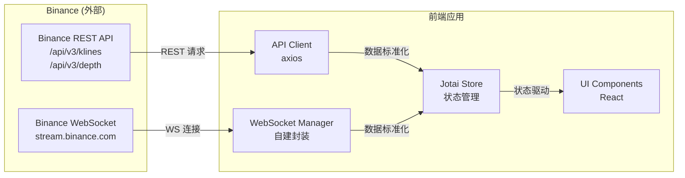

#### CORS 与网络访问

```
┌─────────────────────────────────────────────────────────────┐
│  Binance API CORS 策略                                       │
│                                                             │
│  ✅ REST API：允许跨域（大部分公开接口）                       │
│  ✅ WebSocket：无 CORS 限制                                  │
│                                                             │
│  ⚠️  大陆网络访问限制：                                        │
│  - Binance API 在大陆可能需要代理才能访问                     │
│  - 开发时配置 Vite proxy 转发请求                            │
│  - 或使用 VPN / 科学上网工具                                  │
│                                                             │
│  开发环境配置（vite.config.ts）：                             │
│  - proxy 转发 REST API                                      │
│  - WebSocket 可能需要额外代理工具                             │
└─────────────────────────────────────────────────────────────┘
```

**Vite 代理配置示例**：

```typescript
// vite.config.ts
export default defineConfig({
  server: {
    proxy: {
      '/api': {
        target: 'https://api.binance.com',
        changeOrigin: true,
        rewrite: (path) => path.replace(/^\/api/, '')
      }
    }
  }
});
```

---

### 0.3 订单簿状态机规范

> **核心问题：订单簿是 快照 + 增量 diff 合成的状态机，必须处理序列校验和 Gap 恢复。**

#### 状态机定义

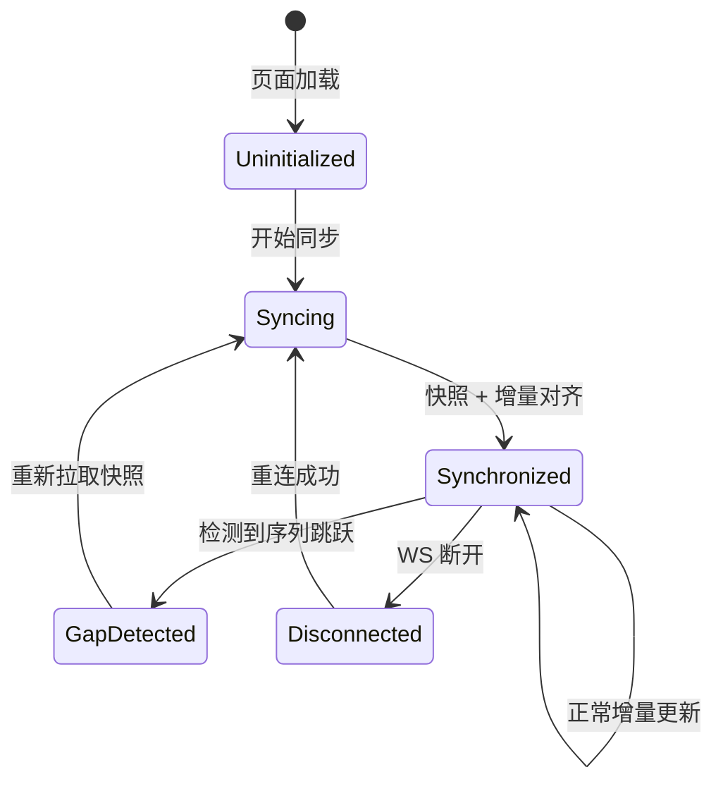

#### Binance 订单簿同步协议

根据 [Binance API 文档](https://binance-docs.github.io/apidocs/spot/en/#diff-depth-stream)：

```
┌─────────────────────────────────────────────────────────────┐
│  同步流程                                                    │
│                                                             │
│  1. 订阅 WS 增量流：{symbol}@depth                           │
│  2. 缓存增量事件（先不应用）                                   │
│  3. 请求 REST 快照：GET /api/v3/depth?limit=1000            │
│  4. 丢弃 u <= lastUpdateId 的增量事件                        │
│  5. 第一个 U <= lastUpdateId+1 且 u >= lastUpdateId+1       │
│     的事件开始应用                                            │
│  6. 后续每个事件的 U == 前一个事件的 u+1                      │
│                                                             │
│  字段说明：                                                   │
│  - lastUpdateId：快照的最后更新 ID                           │
│  - U：增量事件的起始更新 ID                                   │
│  - u：增量事件的结束更新 ID                                   │
└─────────────────────────────────────────────────────────────┘
```

#### 序列校验规则

```typescript
interface DepthEvent {
  U: number;  // First update ID in event
  u: number;  // Final update ID in event
  b: [string, string][];  // Bids
  a: [string, string][];  // Asks
}

interface OrderBookState {
  lastUpdateId: number;
  bids: Map<string, string>;  // price -> quantity
  asks: Map<string, string>;
  status: 'uninitialized' | 'syncing' | 'synchronized' | 'gap_detected';
}

// 校验规则
function validateEvent(event: DepthEvent, state: OrderBookState): boolean {
  // 规则 1：第一个有效事件
  if (state.status === 'syncing') {
    return event.U <= state.lastUpdateId + 1 && event.u >= state.lastUpdateId + 1;
  }
  
  // 规则 2：后续事件必须连续
  if (state.status === 'synchronized') {
    return event.U === state.lastUpdateId + 1;
  }
  
  return false;
}
```

#### Gap 恢复流程

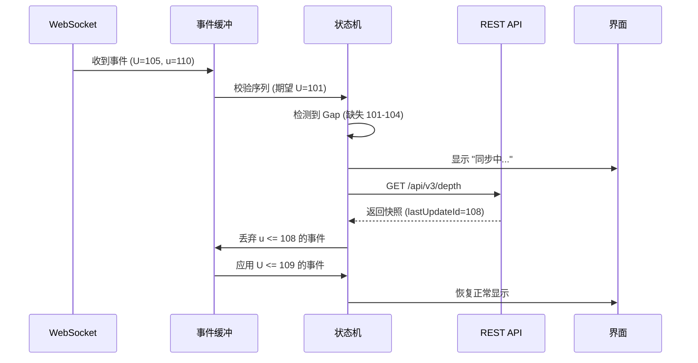

#### 实现要点

```
┌─────────────────────────────────────────────────────────────┐
│  OrderBook 实现 Checklist                                    │
│                                                             │
│  ☐ 事件缓冲队列（在快照返回前缓存增量）                        │
│  ☐ 序列号校验（每次更新检查 U 和 u）                          │
│  ☐ Gap 检测（U != lastUpdateId + 1 时触发）                  │
│  ☐ 自动恢复（检测到 Gap 后重新拉快照）                        │
│  ☐ 状态指示（UI 显示同步状态：正常/同步中/断连）               │
│  ☐ 防抖保护（短时间内多次 Gap 不重复请求）                    │
│  ☐ 超时处理（快照请求超时后重试）                             │
└─────────────────────────────────────────────────────────────┘
```

---

### 0.4 限流与容错策略

#### Binance API 限流规则

| 接口类型 | 限流规则 | 应对策略 |
|---------|---------|---------|
| REST API | 1200 请求/分钟 (IP) | 请求队列 + 节流 |
| WebSocket | 5 条消息/秒 (连接) | 批量订阅 |
| WebSocket 连接 | 最多 5 个连接 | 复用连接 |

#### 错误码处理

| 错误码 | 含义 | 处理方式 |
|-------|------|---------|
| 429 | 请求过多 | 指数退避重试（1s → 2s → 4s） |
| 418 | IP 被封禁 | 提示用户，停止请求 |
| -1121 | 无效交易对 | UI 提示，回退到默认 |
| WS 断开 | 连接丢失 | 自动重连（最多 5 次） |

#### 降级策略

```
┌─────────────────────────────────────────────────────────────┐
│  降级链路                                                    │
│                                                             │
│  Level 1: WebSocket 正常                                     │
│  → 实时推送，延迟 < 100ms                                    │
│                                                             │
│  Level 2: WebSocket 断开，自动重连                            │
│  → 显示 "重新连接中..."，保持最后数据                          │
│                                                             │
│  Level 3: 重连失败，降级到轮询                                │
│  → 每 3s 请求一次 REST API                                   │
│                                                             │
│  Level 4: REST 也失败                                        │
│  → 显示 "网络异常"，只读模式                                  │
└─────────────────────────────────────────────────────────────┘
```

---

## 一、页面架构图

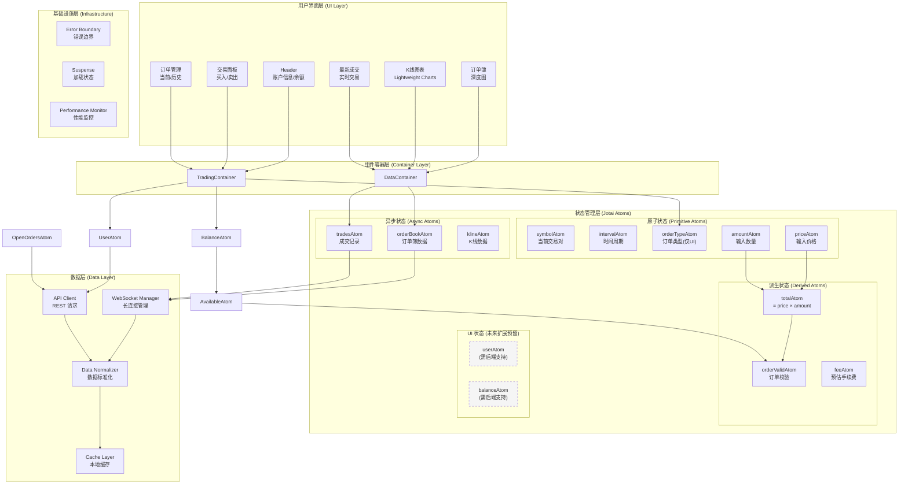

---

## 二、核心模块拆解

### 2.1 组件层级结构

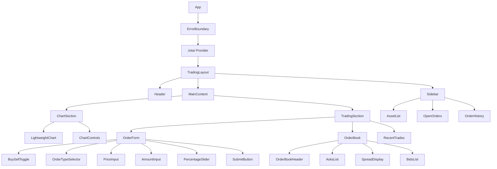

---

#### 状态管理架构 (Jotai)

| Atom Group | Atoms | 说明 |
|------------|-------|------|
| **Symbol** | `symbolConfigAtom` | **[新增]** 当前交易对配置 (Symbol, Base, Quote, 精度) |
| **K-Line** | `klineDataAtom`<br>`intervalAtom` | K线数据、当前时间周期 |
| **OrderBook** | `orderBookAtom` | 订单簿快照 + 增量更新 |
| **Trade** | `tradeFormAtom` | 交易表单状态 (价格, 数量) |
| **Global** | `wsStatusAtom` | WebSocket 连接状态 |

> **交易对切换逻辑**：
> 修改 `symbolConfigAtom` 会触发所有下游 Atom (OrderBook, Kline, Trades) 的重置与重连机制。

## 三、状态管理方案 (Jotai)

### 3.1 Atom 设计原则

| 类别 | Atom 示例 | 说明 | 更新频率 |
|------|----------|------|---------|
| **用户状态** | `userAtom`, `balanceAtom` | 用户身份与资产 | 低频 |
| **交易对状态** | `symbolAtom`, `tickerAtom` | 当前交易标的信息 | 中频 |
| **表单状态** | `priceAtom`, `amountAtom`, `sideAtom` | 订单表单输入 | 高频 |
| **实时数据** | `orderBookAtom`, `tradesAtom` | WebSocket 推送数据 | 极高频 |
| **UI 状态** | `modalAtom`, `loadingAtom` | 界面交互状态 | 按需 |

### 3.2 派生 Atom 链路

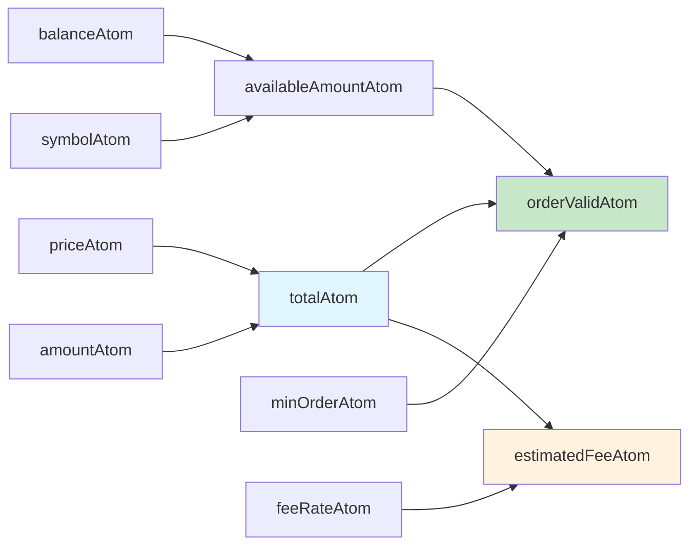

### 3.3 现实问题与解决方案

#### 问题 1：高频更新导致性能问题

> **场景**：OrderBook 每秒推送 20+ 次更新，直接更新 atom 会触发大量重渲染

**解决方案**：

```
┌──────────────────────────────────────────────────────────────┐
│  WebSocket Message                                            │
│       ↓                                                       │
│  Buffer Queue (收集 16ms 内的更新)                            │
│       ↓                                                       │
│  requestAnimationFrame 批量合并                               │
│       ↓                                                       │
│  Immer produce 生成新状态                                     │
│       ↓                                                       │
│  Shallow Compare 决定是否更新                                  │
│       ↓                                                       │
│  只更新变化的价格档位 (React.memo + fine-grained atoms)        │
└──────────────────────────────────────────────────────────────┘
```

#### 问题 2：订单状态轮询与推送冲突

> **场景**：WS 推送的订单状态与 REST 轮询数据存在时间差，导致 UI 闪烁

**解决方案**：

- **乐观更新**：下单成功后立即插入本地状态
- **版本控制**：每条数据附带 `updateTime`，只接受更新的数据
- **状态机**：订单状态只能 `PENDING → PARTIAL → FILLED/CANCELLED`，禁止回退

#### 问题 3：大数字精度丢失

> **场景**：`amount * price` 在 JS 中产生浮点误差，如 `0.1 * 0.2 = 0.020000000000000004`

**解决方案**：

- 使用 `decimal.js` 或 `bignumber.js` 处理所有金额计算
- 定义统一的 `Money` 类型，封装精度处理逻辑
- 服务端下发 `precision` 配置，前端按规则截断/四舍五入

---

## 四、WebSocket 实时数据架构

### 4.1 连接生命周期

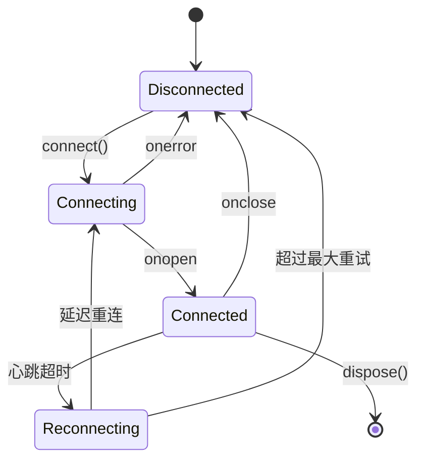

### 4.2 多连接管理策略

#### 连接策略表

| 数据类型 | 连接策略 | 备注 |
|---------|---------|------|
| OrderBook | 组合流订阅 | 通过 combined stream 复用连接 |
| Trades | 组合流订阅 | 与其他流共享连接 |
| K-Line | 组合流订阅 | 切换周期时取消订阅并重新订阅 |
| ~~User Orders~~ | ~~认证连接~~ | 超出当前范围 |

#### Binance Combined Streams（组合流）

Binance 支持在一个 WebSocket 连接中订阅多个数据流，避免达到 5 连接上限。

**使用方式**：

```typescript
// 单独订阅（不推荐，浪费连接数）
wss://stream.binance.com:9443/ws/btcusdt@kline_1m
wss://stream.binance.com:9443/ws/btcusdt@depth
wss://stream.binance.com:9443/ws/btcusdt@trade

// 组合订阅（推荐，一个连接订阅多个流）
wss://stream.binance.com:9443/stream?streams=btcusdt@kline_1m/btcusdt@depth/btcusdt@trade
```

**消息格式区别**：

```typescript
// 组合流消息会包裹一层 {stream, data}
{
  "stream": "btcusdt@kline_1m",
  "data": {
    // 原始 kline 数据
  }
}

// 需要根据 stream 字段分发到对应的处理器
```

**动态订阅管理**：

```typescript
// 通过发送消息来动态添加/删除订阅
ws.send(JSON.stringify({
  method: 'SUBSCRIBE',
  params: ['btcusdt@kline_5m'],
  id: 1
}));

ws.send(JSON.stringify({
  method: 'UNSUBSCRIBE',
  params: ['btcusdt@kline_1m'],
  id: 2
}));
```

### 4.3 现实问题与解决方案

#### 问题 1：移动端切后台断连

> **场景**：iOS Safari 后台 30 秒后会杀死 WebSocket

**解决方案**：

```
┌─────────────────────────────────────────┐
│  visibilitychange 监听                  │
│       ↓                                 │
│  hidden → 记录时间戳，暂停心跳           │
│       ↓                                 │
│  visible → 检查间隔                     │
│       ↓                                 │
│  > 30s → 强制重连 + 拉取增量数据         │
│  < 30s → 恢复心跳 + 检查连接状态         │
└─────────────────────────────────────────┘
```

#### 问题 2：数据序列缺失（Gap）

> **场景**：推送数据包含 `seq`，发现 `seq` 跳跃时表明丢包

**解决方案**：

- 检测到 Gap 后，暂停渲染
- 请求 REST 快照 `/api/orderbook/snapshot`
- 校验 `lastSeq` 后恢复增量更新

#### 问题 3：爆发式消息堆积

> **场景**：行情剧烈波动时，1 秒内收到数百条消息

**解决方案**：

```
┌───────────────────────────────────────────────────┐
│  采用 背压处理 策略：                              │
│                                                   │
│  1. 消息进入 Ring Buffer（固定容量 100）          │
│  2. 新消息覆盖最旧数据（总显示最新状态）           │
│  3. 渲染层以 60fps 为上限消费 Buffer              │
│  4. 监控 Buffer 使用率，超 80% 告警               │
└───────────────────────────────────────────────────┘
```

---

## 五、性能优化策略

### 5.1 渲染优化矩阵

| 组件 | 问题 | 优化手段 | 效果 |
|------|------|---------|------|
| OrderBook | 全量重渲染 | 虚拟列表 + 细粒度 Atom | FPS 60 稳定 |
| K线图 | Canvas 重绘 | Offscreen Canvas + Worker | CPU 降低 40% |
| 订单表单 | 连续输入卡顿 | 防抖 + `useDeferredValue` | 输入流畅 |
| 余额展示 | 频繁更新 | `React.memo` + 选择性订阅 | 渲染减少 90% |

### 5.2 React 18 特性应用

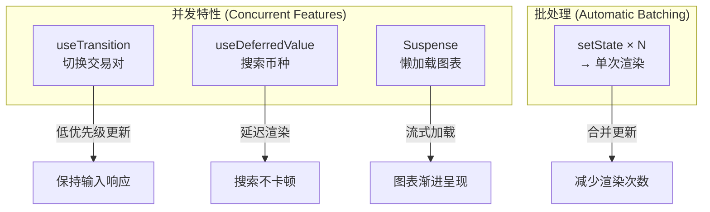

### 5.3 现实问题与解决方案

#### 问题 1：切换交易对时的空白闪烁

> **场景**：切换 BTC/USDT → ETH/USDT，新数据加载前出现白屏

**解决方案**：

```
┌─────────────────────────────────────────────────────┐
│  使用 startTransition 包裹交易对切换逻辑            │
│       ↓                                             │
│  旧数据保持渲染，新数据后台准备                      │
│       ↓                                             │
│  数据准备就绪后，无缝切换                            │
│       ↓                                             │
│  配合 Suspense fallback 展示 Skeleton              │
└─────────────────────────────────────────────────────┘
```

#### 问题 2：长列表 (Order History) 滚动卡顿

> **场景**：用户有 1000+ 历史订单，滚动时明显掉帧

**解决方案**：

- 使用 `react-window` 虚拟列表
- 只渲染视口内 ±2 的行
- 滚动时用 `will-change: transform` 提示浏览器优化
- 分页加载，每次请求 50 条

#### 问题 3：图表与数据更新冲突

> **场景**：K 线图 Canvas 绑架主线程，影响其他交互

**解决方案**：

- 图表计算移入 Web Worker
- 使用 `OffscreenCanvas` 进行离屏渲染
- 主线程只处理用户交互事件

---

## 六、K线图技术方案 (重点模块)

K线图是交易页面最复杂的模块之一，涉及大量数据处理、高频更新、丰富的交互和性能优化。

### 6.1 整体架构

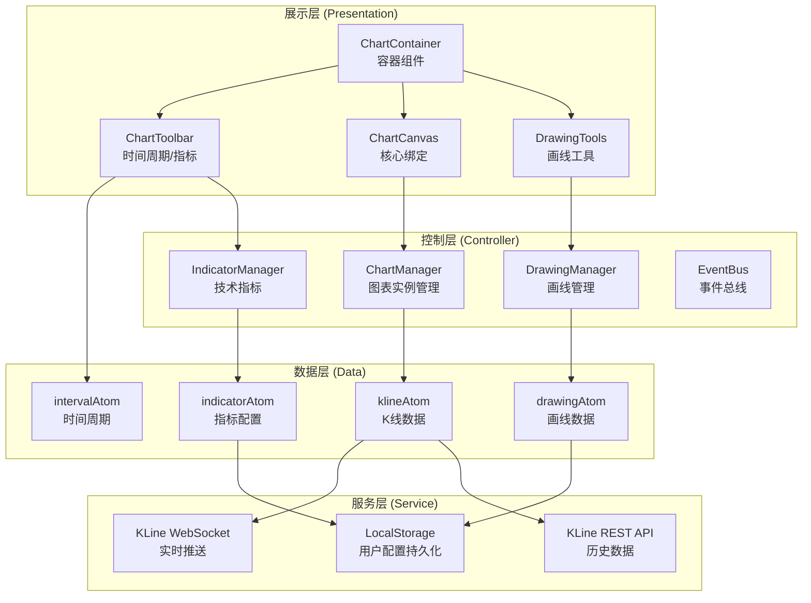

### 6.2 技术选型：Lightweight Charts

**选择理由**：

| 优势 | 说明 |
|------|------|
| 开源免费 | MIT 协议，无授权成本 |
| 轻量高效 | 体积 ~40KB，性能优秀 |
| 技术深度 | 需要自己处理数据、优化性能，展示技术能力 |
| 扩展性强 | API 简洁，易于二次开发 |
| 生产验证 | Binance、OKX 等交易所使用 |

### 6.3 数据流设计

#### 数据结构定义

```typescript
interface Candle {
  time: number;      // Unix 时间戳 (秒)
  open: string;      // 开盘价 (字符串避免精度问题)
  high: string;      // 最高价
  low: string;       // 最低价
  close: string;     // 收盘价
  volume: string;    // 成交量
}

interface KLineState {
  symbol: string;
  interval: '1m' | '5m' | '15m' | '1h' | '4h' | '1d';
  candles: Candle[];
  lastUpdateTime: number;
}
```

#### 数据加载流程

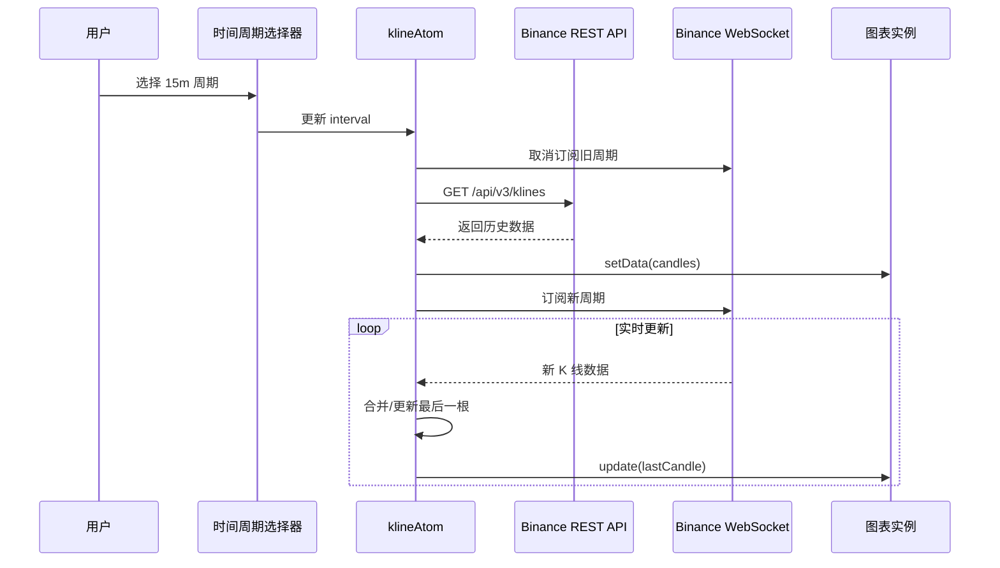

### 6.4 Binance API 集成

#### REST API

```typescript
// 获取历史 K 线
GET https://api.binance.com/api/v3/klines
参数:
  - symbol: BTCUSDT
  - interval: 1m, 5m, 15m, 1h, 4h, 1d
  - limit: 500 (默认)
  - startTime: 可选
  - endTime: 可选
```

#### WebSocket API

```typescript
// 订阅 K 线实时推送
wss://stream.binance.com:9443/ws/btcusdt@kline_1m

消息格式:
{
  "e": "kline",
  "E": 1638747660000,
  "s": "BTCUSDT",
  "k": {
    "t": 1638747660000,  // 开盘时间
    "T": 1638747719999,  // 收盘时间
    "s": "BTCUSDT",
    "i": "1m",
    "o": "57000.00",     // 开盘价
    "c": "57100.00",     // 收盘价
    "h": "57200.00",     // 最高价
    "l": "56900.00",     // 最低价
    "v": "100.5",        // 成交量
    "x": false           // 是否完结
  }
}
```

### 6.5 性能优化策略

#### 问题 1：大数据量渲染卡顿

> **场景**：加载 5000+ 根 K 线，缩放/拖拽时明显卡顿

**解决方案**：

```
┌─────────────────────────────────────────────────────────────┐
│  分层渲染架构 (Layer-based Rendering)                        │
│                                                             │
│  Layer 1: 背景层 (网格、坐标轴) - 静态，只绘制一次            │
│  Layer 2: 数据层 (K线、成交量) - 视口内数据，动态裁剪         │
│  Layer 3: 指标层 (MA、MACD)   - 独立 Canvas，可开关           │
│  Layer 4: 交互层 (十字线、提示) - requestAnimationFrame       │
│                                                             │
│  优化效果：                                                  │
│  - 只重绘变化的层                                            │
│  - 视口外数据不参与渲染                                       │
│  - FPS 从 15 提升到 60                                       │
└─────────────────────────────────────────────────────────────┘
```

#### 问题 2：高频实时更新

> **场景**：1 秒收到多条同一根 K 线的更新，频繁 setState

**解决方案**：

```
┌─────────────────────────────────────────────────────────────┐
│  合并更新策略                                                │
│                                                             │
│  WS Message                                                 │
│      ↓                                                      │
│  收集 Buffer (同一根K线只保留最新)                           │
│      ↓                                                      │
│  requestAnimationFrame 消费                                 │
│      ↓                                                      │
│  直接调用图表库 API 更新                                      │
│  (不经过 React 状态更新)                                     │
│      ↓                                                      │
│  关键 Atom（如收盘价）按需更新                                │
└─────────────────────────────────────────────────────────────┘
```

### 6.6 现实问题与解决方案

#### 问题 1：图表库与 React 状态双向绑定

> **场景**：十字线移动时，需要同步更新 React 组件（价格提示、指标数值）

**解决方案**：

```typescript
// ❌ 避免：图表状态 ↔ React 状态 双向绑定

// ✅ 推荐：单向数据流 + 事件驱动
// 1. React → 图表：通过 atom 变化触发图表 API 调用
// 2. 图表 → React：通过 EventBus 发布事件

const crosshairMoveHandler = (param) => {
  eventBus.emit('crosshair:move', param);
  // 不直接 setState，由订阅方决定是否更新
}

// 订阅方使用 useEffect + 防抖
useEffect(() => {
  const handler = debounce((data) => setInfo(data), 16);
  eventBus.on('crosshair:move', handler);
  return () => eventBus.off('crosshair:move', handler);
}, []);
```

#### 问题 2：切换交易对时图表闪烁

> **场景**：从 BTC/USDT 切换到 ETH/USDT，图表出现空白

**解决方案**：

```
┌─────────────────────────────────────────────────────────────┐
│  平滑切换策略                                                │
│                                                             │
│  1. 使用 startTransition 标记低优先级更新                    │
│  2. 新数据加载完成前，保持旧图表显示                          │
│  3. 骨架屏 Overlay 覆盖，而非清空图表                         │
│  4. 新数据就绪后，一次性替换                                  │
│                                                             │
│  时序：                                                      │
│  [旧图表] → [旧图表 + Loading Overlay] → [新图表]            │
└─────────────────────────────────────────────────────────────┘
```

---

## 七、错误处理与容灾

### 7.1 错误分类与处理策略

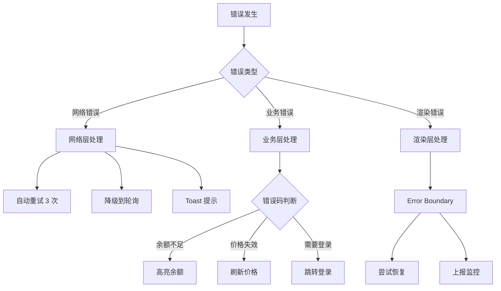

### 7.2 关键错误场景

| 场景 | 现象 | 处理方案 |
|------|------|---------|
| Binance API 限流 | 429 Too Many Requests | 指数退避重试 + 队列控制 |
| WS 消息格式错误 | 数据解析失败 | 忽略单条 + 监控上报 |
| 价格极端波动 | 价格颜色乱跳 | 添加阈值过滤，超限确认 |
| 网络断开 | 按钮无响应 | 离线检测 + 禁用按钮 + 提示重连 |

---

## 八、技术选型总结

| 领域 | 技术选型 | 选择理由 |
|------|---------|---------|
| 框架 | React 18.2 | 并发特性、生态完善 |
| 状态管理 | Jotai | 原子化设计、细粒度更新 |
| 构建工具 | Vite | 快速冷启动、HMR 优秀 |
| 语言 | TypeScript | 类型安全、开发体验好 |
| 样式 | Tailwind CSS | 快速开发、一致性好 |
| K线图表 | Lightweight Charts | 轻量、开源、可扩展 |
| 虚拟列表 | react-window | 轻量、性能优秀 |
| 精度处理 | decimal.js | 金融级精度支持 |
| HTTP 请求 | axios | 拦截器、错误处理完善 |
| WebSocket | 自建封装 | 定制重连逻辑 |
| 时间处理 | dayjs | 轻量、API 友好 |

---

## 九、目录结构

```
trading-app/
├── public/
├── src/
│   ├── components/           # 通用 UI 组件
│   │   ├── Button/
│   │   ├── Input/
│   │   └── Modal/
│   │
│   ├── features/             # 功能模块
│   │   ├── chart/            # K线图模块
│   │   │   ├── components/
│   │   │   │   ├── ChartContainer.tsx
│   │   │   │   ├── ChartToolbar.tsx
│   │   │   │   └── IntervalSelector.tsx
│   │   │   ├── atoms/
│   │   │   │   ├── klineAtom.ts
│   │   │   │   └── intervalAtom.ts
│   │   │   ├── hooks/
│   │   │   │   ├── useChartInstance.ts
│   │   │   │   └── useKlineData.ts
│   │   │   └── services/
│   │   │       ├── klineApi.ts
│   │   │       └── klineWebSocket.ts
│   │   │
│   │   ├── orderbook/        # 订单簿模块
│   │   ├── trading/          # 交易表单模块
│   │   └── orders/           # 订单管理模块
│   │
│   ├── services/             # 全局服务
│   │   ├── api/              # REST API
│   │   │   ├── client.ts
│   │   │   └── binance.ts
│   │   ├── websocket/        # WS 管理
│   │   │   ├── manager.ts
│   │   │   └── reconnect.ts
│   │   └── storage/          # 本地存储
│   │
│   ├── atoms/                # 全局 Jotai atoms
│   │   ├── user.ts
│   │   ├── symbol.ts
│   │   └── balance.ts
│   │
│   ├── hooks/                # 全局 hooks
│   │   ├── useWebSocket.ts
│   │   └── useDebounce.ts
│   │
│   ├── utils/                # 工具函数
│   │   ├── decimal.ts
│   │   ├── format.ts
│   │   └── time.ts
│   │
│   ├── types/                # TypeScript 类型
│   │   ├── binance.ts
│   │   ├── chart.ts
│   │   └── order.ts
│   │
│   ├── styles/               # 全局样式
│   │   └── globals.css
│   │
│   ├── App.tsx
│   └── main.tsx
│
├── package.json
├── tsconfig.json
├── vite.config.ts
├── tailwind.config.js
└── README.md
```

---

## 十、开发计划

### Phase 1: 项目骨架 + K 线图模块 (3-4 天)

```
Day 1: 项目初始化
├── 初始化 Vite + React + TypeScript
├── 配置 Tailwind CSS
├── 配置 Jotai
└── 搭建基础目录结构

Day 2-3: K 线图基础功能
├── Lightweight Charts 集成
├── Binance REST API 获取历史数据
├── 数据格式转换与展示
├── 时间周期切换
└── 基础样式

Day 4: K 线图实时更新
├── Binance WebSocket 集成
├── 实时数据合并逻辑
├── 性能优化（Buffer + RAF）
└── 错误处理
```

### Phase 2: 订单簿模块 (2-3 天)

```
├── 订单簿数据获取（REST + WS）
├── 虚拟列表渲染
├── 买卖盘深度展示
├── 价格点击联动
└── 实时更新优化
```

### Phase 3: 交易表单模块 (2-3 天)

```
├── 买入/卖出表单
├── 价格/数量输入
├── 百分比滑块
├── 表单校验
├── 精度处理（decimal.js）
└── 提交逻辑（模拟）
```

### Phase 4: 整合 + 优化 (2-3 天)

```
├── 模块联动（订单簿 → 表单）
├── 响应式布局
├── 性能优化
├── 错误边界
└── 单元测试
```

---

## 十一、验证与测试

### 功能验证

- [ ] K 线图正确展示历史数据
- [ ] 时间周期切换无闪烁
- [ ] 实时数据正确更新
- [ ] 订单簿深度正确展示
- [ ] 交易表单校验正确
- [ ] 精度计算无误差

### 性能验证

- [ ] K 线图 FPS ≥ 60
- [ ] 订单簿滚动流畅
- [ ] 表单输入无卡顿
- [ ] 内存无泄漏

### 兼容性验证

- [ ] Chrome 最新版
- [ ] Safari 最新版
- [ ] 移动端适配

---

## 附录：Binance API 参考

### REST API 端点

| 接口 | 用途 | 限流 |
|------|------|------|
| `GET /api/v3/klines` | K 线历史数据 | 1200/min |
| `GET /api/v3/depth` | 订单簿快照 | 1200/min |
| `GET /api/v3/trades` | 最近成交 | 1200/min |
| `GET /api/v3/ticker/24hr` | 24h 行情 | 40/min |

### WebSocket 流

| 流 | 用途 | 更新频率 |
|---|------|---------|
| `{symbol}@kline_{interval}` | K 线实时推送 | 1s |
| `{symbol}@depth` | 订单簿增量推送 | 100ms |
| `{symbol}@trade` | 成交实时推送 | 实时 |
| `{symbol}@ticker` | 24h 行情推送 | 1s |

---

**方案确认后即可开始开发！** 🚀
